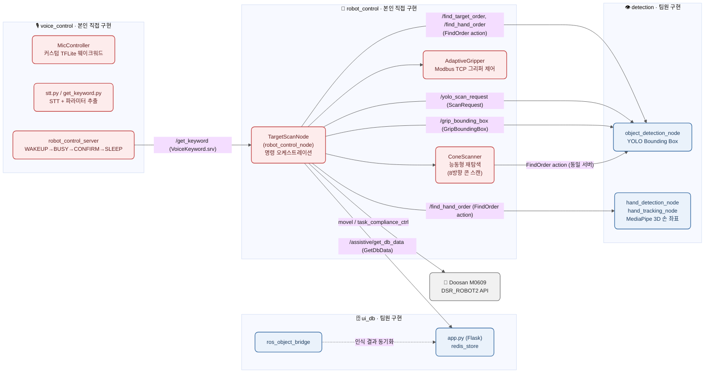
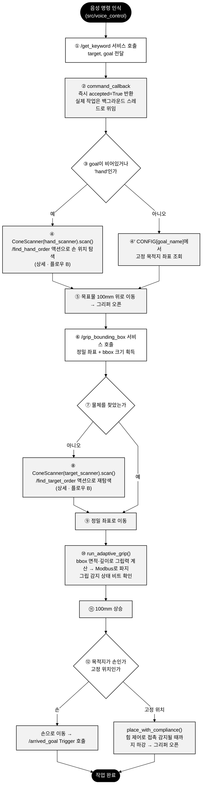
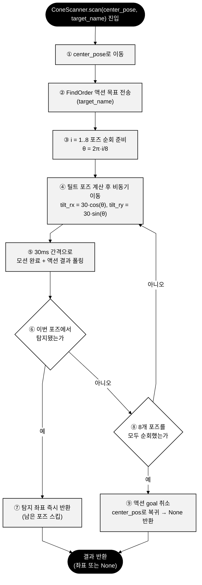

# Hey Doopal — 시각장애인 맞춤형 음성 제어 로봇 보조 시스템

> 음성 명령만으로 협동로봇(Doosan M0609)이 주변 사물을 탐색·파지해 시각장애인 사용자 손에 전달하는 Voice-to-Robot 보조 시스템 (4인 팀 프로젝트, 2026.07.16~2026.07.29)

이 저장소는 팀 프로젝트 "Hey Doopal"의 통합 코드베이스다. **로봇 제어(`src/robot_control`)와 음성 명령 처리(`src/voice_control`)는 본인이 직접 구현**했고, **Object/Hand Detection(`src/detection`)과 DB·UI(`src/ui_db`)는 팀원이 구현**한 코드를 프로젝트 전체 구조 이해를 돕기 위해 함께 포함했다. 원본 팀 저장소: [sonnanlo2125-a11y/simbongsa](https://github.com/sonnanlo2125-a11y/simbongsa) (브랜치별 팀원 작업 분리)

## Key Features

- **능동형 재탐색 (Cone Scan)**: TCP를 고정한 채 Rx/Ry 8자세로 회전하며 물체를 재탐색하는 스캔 로직 — 1회 스캔에 물체가 탐지되지 않아도 포기하지 않고 다각도로 재시도
- **ROS2 Action 기반 통신**: Goal-Feedback-Result 구조의 `FindOrder`/`FindTargetOrder` 커스텀 액션으로 로봇 제어 노드와 비전/DB 파트 간 비동기 통신을 처리
- **Compliance/Force 기반 안전 파지**: 접촉력(|Fz|) 기준으로 파지 판정을 수행해 다양한 크기의 물체를 안전하게 그립
- **음성 명령 처리 (직접 구현)**: WAKEUP → BUSY → CONFIRM → SLEEP 상태머신, 커스텀 TFLite 웨이크워드 모델(`MicController`), STT + 자연어 파라미터 추출(`get_keyword`)로 로봇 제어 서버에 목표물/목적지를 전달

## System Architecture

빨간색 박스가 본인이 직접 구현한 `robot_control`·`voice_control` 파트다. 파란색 박스는 팀원이 구현한 `detection`·`ui_db` 파트로, 이번 정리에서 참고용으로 저장소에 함께 포함했다 (`src/` 이하 구조는 [Repository 구조](#repository-구조) 참고).

## 동작 플로우

### A. 음성 명령 → 물체 탐색·파지 → 전달

### B. Cone Scan 능동형 재탐색 상세

## Tech Stack

| 구분 | 내용 |
|---|---|
| 언어 | Python |
| 로봇 미들웨어 | ROS2 Humble (rclpy, Action/Service) |
| 로봇 | Doosan Robotics M0609 (DR_init / DSR 제어 API) |
| 음성 | 커스텀 TFLite 웨이크워드, STT, 자연어 파라미터 추출 |
| 비전 (팀원) | YOLOv8, MediaPipe |
| DB·UI (팀원) | Flask, Redis |
| 통신 | 커스텀 ROS2 Action/Service (`hey_doopal_msg`, `od_msg`) |

## Repository 구조

| 경로 | 설명 |
|---|---|
| `src/robot_control/` | 로봇 제어 ROS2 Action Server — Cone Scan, 안전 파지, DSR 제어 (**본인 직접 구현**) |
| `src/voice_control/` | 음성 명령 처리 — 웨이크워드, STT, 자연어 파라미터 추출, 상태머신 (**본인 직접 구현**) |
| `src/hey_doopal_msg/` | 팀 공용 커스텀 ROS2 Action/Service 인터페이스 (`FindOrder`, `ScanRequest`, `GripBoundingBox`, `VoiceKeyword`, `GetDbData` 등) |
| `src/detection/` | YOLO 물체 인식 · MediaPipe 손 추적 노드 (팀원 구현, 구조 이해를 위해 포함) |
| `src/ui_db/` | Flask 기반 재고/이벤트 관리 웹 UI · Redis 연동 (팀원 구현, 구조 이해를 위해 포함) |

> `src/detection/`, `src/ui_db/` 는 팀원이 구현했으며, 학습된 YOLO 가중치(`.pt`) 등 대용량 바이너리는 포함하지 않았다. 전체 팀원별 원본 브랜치는 [원본 팀 저장소](https://github.com/sonnanlo2125-a11y/simbongsa/branches/all)에서 확인할 수 있다.

## 담당 파트

본 프로젝트는 4인 팀 프로젝트다. **음성 인식(자연어 명령 처리)과 로봇 제어**는 본인이 직접 구현했고 (`src/robot_control`, `src/voice_control`), **Object Detection(YOLO 기반 비전 인식)과 DB·UI(손 추적·웹 인터페이스)**는 팀원이 담당했다 (`src/detection`, `src/ui_db`).
